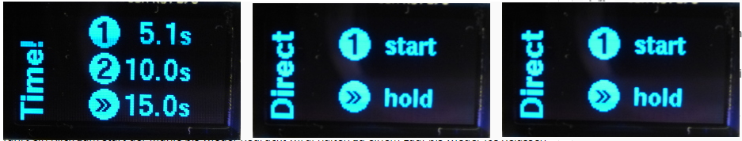
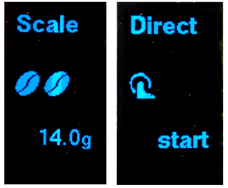
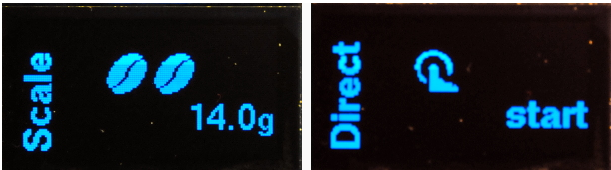
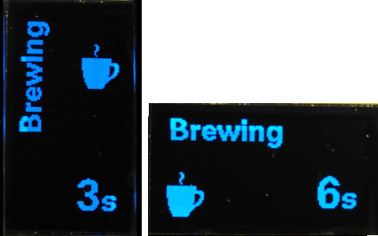
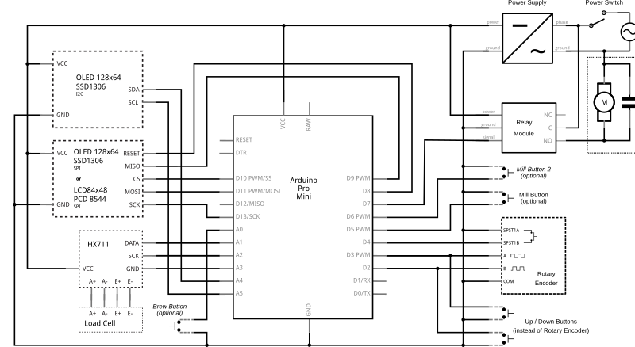

# MillControl
## Arduino Coffee Grinder Control

### THIS DESCRIPTION IS A BIT OUT OF DATE I WILL UPDATE IT WHEN I GET TO IT. 
If you speak german please refer to: 
https://www.kaffee-netz.de/threads/millcontrol-arduino-muehlensteuerung-mit-timer-gewichtsautomatik-und-brew-timer.95553/

This was designed to build a time controlled coffee grinder out of any regular machine. It was developed to be used with a Graef CM 70 but it should work fine with any brand or model.

### Requirements
 - Runs on Arduino Pro Mini & compatible systems (should be most arduino machines having a ATmega328 or better CPU, needs 32k of storage space).
 - Needs a rotary encoder with a switch and an optional second switch (mill switch). If you only have one switch comment out the define in UI.h
 - Output is to a 128*64 graphics display, comment out the orientation define in UI.h

### Dependencies:
- ClickButton - https://code.google.com/p/clickbutton/
- Encoder (v1.2) - http://www.pjrc.com/teensy/td_libs_Encoder.html
- TimerOne (v1.1) - https://github.com/PaulStoffregen/TimerOne
- U8Glib - https://github.com/olikraus/u8glib

### User Interface
#### Select a Time Mode
You can select from up to 20 timer modes with settings fr time or weight. 
There are two different time modes: multi selection and single selection (FLAT_MODE in UI.h).

##### multi selection
For every mode there are timeings for a single click, double click (or mill switch 2, if available) and long click.
For a click mode you can set a time / weight or "start/stop" (start mill with click start and stopping it at the next) or hold (longer click, only if more buttons are available).
If there is no mill button then you can only choose from single and double click. Long click is then bound to the edit menu.

###### Portrait mode

###### Landscape Mode

##### single selection
Every time / weight has it own side. With one click will this site be startet. In the direct mode ("start") will one click start the mill until anothe click stopps the mill, hold (the hold function also does something. But not clear what.).

###### Portrait mode

###### Landscape Mode

#### Edit a Time Mode
There is an extensive editor allowing you to add (+), delete (x), move (<>) and edit time modes. For a time mode the respective times and the title are editable.

##### Portrait mode

##### Landscape Mode

#### Run!!
Finally the idea of the timer is to run. So there is a run mode... It is started from select mode as explained above. In a timed run there is a progress bar at the bottom of the screen.

A run can be stopped any time by pressing the button used to start the run. For 5 seconds the run will pause and if you re-click it can be continued. 

##### Portrait mode

##### Landscape mode

### Brew-Timer
If you set on A0 a "taster" (don't know the english word) you can get a brew-timer. The timer will be cancled by any interaction and cannot be started during the milling process.

### Schematic
I prefer a old school schmatic style over those fanzy fritzing pictures. Still I added them below in case you prefer them. 

### (c) 2015 by Roman Seidl

This program is free software; you can redistribute it and/or modify
it under the terms of the GNU General Public License as published by
the Free Software Foundation; either version 3 of the License, or
(at your option) any later version.

This program is distributed in the hope that it will be useful,
but WITHOUT ANY WARRANTY; without even the implied warranty of
MERCHANTABILITY or FITNESS FOR A PARTICULAR PURPOSE.  See the
GNU General Public License for more details.

You should have received a copy of the GNU General Public License
along with this program; if not, write to the Free Software Foundation,
Inc., 51 Franklin Street, Fifth Floor, Boston, MA 02110-1301  USA

All trademarks mentioned belong to their owners, third party brands, product names, trade names, corporate names and company names mentioned may be trademarks of their respective owners or registered trademarks of other companies and are used for purposes of explanation and to the owner's benefit, without implying a violation of copyright law. 
