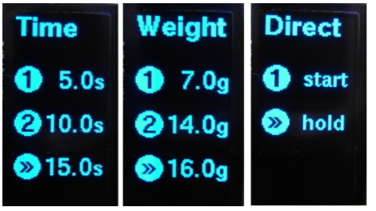

# MillControl
## Arduino Coffee Grinder Control

### THIS DESCRIPTION IS A BIT OUT OF DATE I WILL UPDATE IT WHEN I GET TO IT. 
If you speak german please refer to: 
https://www.kaffee-netz.de/threads/millcontrol-arduino-muehlensteuerung-mit-timer-gewichtsautomatik-und-brew-timer.95553/

This was designed to build a time controlled coffee grinder out of any regular machine. It was developed to be used with a Graef CM 70 but it should work fine with any brand or model.

### Requirements
 - Runs on Arduino Pro Mini & compatible systems (should be most arduino machines having a ATmega328 or better CPU, needs 32k of storage space).
 - Needs a rotary encoder with a switch and an optional second switch (mill switch). If you only have one switch comment out the define in UI.h
 - Output is to a 128*64 graphics display, comment out the orientation define in UI.h

### Dependencies:
- Encoder (v1.4) - http://www.pjrc.com/teensy/td_libs_Encoder.html
- TimerOne (v1.1) - https://github.com/PaulStoffregen/TimerOne
- U8Glib - https://github.com/olikraus/u8glib

### User Interface
#### Select a Time Mode
You can select from up to 20 timer modes with settings fr time or weight. 
There are two different time modes: multi selection and single selection (FLAT_MODE in UI.h).

##### multi selection
For every mode there are timeings for a single click, double click (or mill switch 2, if available) and long click.
For a click mode you can set a time / weight or "start/stop" (start mill with click start and stopping it at the next) or hold (longer click, only if more buttons are available).
If there is no mill button then you can only choose from single and double click. Long click is then bound to the edit menu.

###### Portrait mode

###### Landscape Mode

##### single selection
Every time / weight has it own side. With one click will this site be startet. In the direct mode ("start") will one click start the mill until anothe click stopps the mill, hold (the hold function also does something. But not clear what.).

###### Portrait mode

###### Landscape Mode

#### Settings
There is an extensive editor allowing you to change the mode (g + w), add a page (+), delete (x) and move (<>). 
Basically there are two modes: time and weights mode

##### time mode
For a time mode the respective times and the title are editable.

###### Portrait mode

###### Landscape Mode

##### weight mode
Alternativly ther is a "weight mode automation". A grinde speed will be set in sec/gramms (which is basically also grind duration) and additional some weights. The titel of the page can also beedit.

###### automatic calibration
If you push the mill button inside the editor (or long pressthe encoder button if there is no mill button) the the calibration will be startet.

- in order to start the calibration you should measure the amount of the cup to which you are going to grind the coffee. This will be used to train the scale.
- if the calibration is started the mill runs until the button is released ( or if the button is pushed again, e.g. if you have only one button). You should grind at least one normal portion. More would be more accurate.
- after that the automatic will ask for the weight which was ground. Therefore you will need to measure it, select the weight on the menu and confirm with the encode button.
- After that the grind-speed will be set automatically

###### Portrait mode

###### Landscape Mode

#### Grind!
The grinding will be started from the coresponding site with the correct button. If there is a programmed grind time or a weight, there will be a progress bar.
A grinding can be cancled any time by pushing the button which was used to start the grinding. If there is a programmed grindtime, the process will be stoped for 5 secounds and can be resumed with a new button push.
During the grind process the user can change the grind time by turning the turining button. This change will not be saved.

##### Portrait mode

##### Landscape mode

### Brew-Timer
If you set on A0 a "taster" (don't know the english word) you can get a brew-timer. The timer will be cancled by any interaction and cannot be started during the milling process.

### Schematic
I prefer a old school schmatic style over those fanzy fritzing pictures. Still I added them below in case you prefer them. 

### (c) 2015 by Roman Seidl

This program is free software; you can redistribute it and/or modify
it under the terms of the GNU General Public License as published by
the Free Software Foundation; either version 3 of the License, or
(at your option) any later version.

This program is distributed in the hope that it will be useful,
but WITHOUT ANY WARRANTY; without even the implied warranty of
MERCHANTABILITY or FITNESS FOR A PARTICULAR PURPOSE.  See the
GNU General Public License for more details.

You should have received a copy of the GNU General Public License
along with this program; if not, write to the Free Software Foundation,
Inc., 51 Franklin Street, Fifth Floor, Boston, MA 02110-1301  USA

All trademarks mentioned belong to their owners, third party brands, product names, trade names, corporate names and company names mentioned may be trademarks of their respective owners or registered trademarks of other companies and are used for purposes of explanation and to the owner's benefit, without implying a violation of copyright law. 
